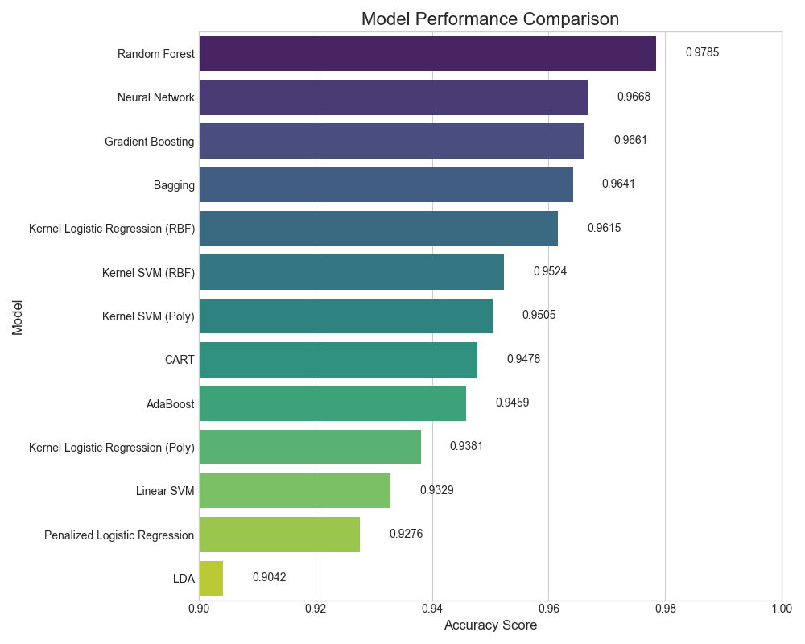
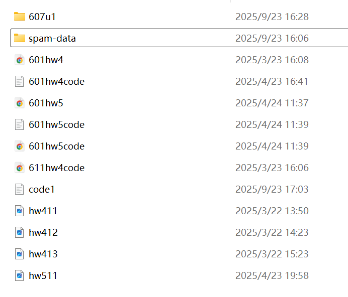

# STATS-607-Unit-1-Project：Spam Classification – Reproducible ML Project

## 1) Problem Overview
This repository implements a classic **binary email spam classification** benchmark. Each email is represented by **57 hand‑crafted features**: 
 - 48 word-frequency percentages (e.g., presence of specific tokens);
 - 6 character-frequency percentages (for a set of punctuation marks); 
 - 3 statistics about sequences of capital letters (average run length, longest run, and total length). 

The corpus contains **4,601 messages** split into a fixed **training set (3,065)** and **test set (1,536)**.  
In this project we **only use the standardized version of the data** (column‑wise mean 0, variance 1) to enable a clean, apples‑to‑apples comparison across models. Our goal is to train a diverse set of supervised classifiers and evaluate their **test accuracy** under the same preprocessing pipeline.

---

## 2) Implemented Models (13 total)
**Linear & Kernel‑based**
- Penalized Logistic Regression
- Linear Discriminant Analysis (LDA)
- Kernel Logistic Regression (Gaussian / RBF)
- Kernel Logistic Regression (Polynomial)

**Tree‑based**
- CART (Decision Tree)
- Bagging
- Random Forest
- AdaBoost
- Gradient Boosting

**Neural Network**
- Feedforward MLP (1–2 hidden layers)

**Support Vector Machines**
- Linear SVM
- SVM (Gaussian / RBF kernel)
- SVM (Polynomial kernel)

All models are trained **only on standardized features** and evaluated on the held‑out test set.


---

## 3) Project Structure
- `data/`
  - `raw/` – immutable source data (read‑only)
  - `processed/` – standardized train/test CSVs produced by the pipeline
- `src/`
  - `pipeline/`
    - `01_preprocess.py` – load raw data and write standardized CSVs to `data/processed/`
  - `analysis/`
    - `02_linear_and_kernel_models.py` – Penalized Logistic Regression, LDA, and Kernel Logistic Regression (RBF/Polynomial)
    - `03_tree_based_models.py` – CART, Bagging, Random Forest, AdaBoost, Gradient Boosting
    - `04_neural_network.py` – feedforward MLP (PyTorch)
    - `05_svm_models.py` – Linear SVM, RBF SVM, Polynomial SVM
    - `06_summary_results.py` – aggregate all model CSVs and produce final summary + figure
    - `klr.py` – custom Kernel Logistic Regression estimator used by `02_*`
- `artifacts/` – intermediate outputs from each model script (CSV)
- `results/`
  - `tables/` – final comparison CSV(s)
  - `figures/` – plots generated by the summary script
- `tests/` – automated tests (`pytest`)
- `run_analysis.py` – single entry point to run the entire pipeline
- `requirements.txt` – Python dependencies
- `README.md` – this document

---

## 4) Getting Started
This project is designed to be fully reproducible with a single command. Follow these instructions to set up the project on any fresh system.

### Prerequisites
- Git
- Python **3.8+**

### Clone the repository
```bash
git clone https://github.com/EveretteWei/STATS-607-Unit-1-Project.git
cd STATS-607-Unit-1-Project
```

### Create and activate a virtual environment
**Windows**
```bash
python -m venv 607u1
607u1\Scripts\activate
```
**macOS / Linux**
```bash
python3 -m venv 607u1
source 607u1/bin/activate
```

### Install dependencies
```bash
pip install -r requirements.txt
```

---

## 5) One‑Command Execution
Run the full end‑to‑end pipeline (standardize data → train all 13 models → aggregate results → plot comparison):

```bash
python run_analysis.py
```

The entry point orchestrates `01_preprocess.py` through `06_summary_results.py` and stops on the first error with a clear message.

---

## 6) Run Analysis Results
After a successful run, the following outputs are produced:

- **Final summary CSV** (sorted by accuracy, descending):  
  [`results/tables/final_model_comparison.csv`](results/tables/final_model_comparison.csv)

- **Performance figure**:  
  `results/figures/model_performance_comparison.png`

The figure is embedded below:



> Each model group also writes its own intermediate artifacts to `artifacts/`:
> - `linear_model_results.csv`, `tree_model_results.csv`, `nn_model_results.csv`, `svm_model_results.csv`  
>   (each must contain at least: `model_name, accuracy`).

---

## 7) Testing Strategy
We use `pytest` with three layers of checks:
- **Data validation** – processed files exist and have expected shapes/columns
- **Function correctness** – per‑model CSVs contain required columns
- **Pipeline integrity** – one‑command run produces all expected outputs

Run tests via:
```bash
pytest
```

---

## 8) Documentation & Style
- Code docstrings follow **PEP 257** (concise one‑line summary + details, with `Args`/`Returns` where applicable).
- Inline comments are kept minimal and in English.
- Scripts print clear progress messages so the pipeline is easy to audit in logs.

An example in [`src/analysis/klr.py`](src/analysis/klr.py) is as follows:

```python
def _kernel_logistic_regression_path(K, y, max_iter, tol=1e-4, coef=None, solver='lbfgs', C=1):
    """Optimize kernel logistic regression coefficients.

    Uses L-BFGS-B to minimize the objective in `_loss_and_grad`. If an initial
    coefficient vector is not provided, initializes `w0` as zeros.

    Args:
        K (np.ndarray): Kernel Gram matrix, shape (n_samples, n_samples).
        y (np.ndarray): Binary targets in {0,1}, shape (n_samples,).
        max_iter (int): Maximum optimizer iterations.
        tol (float): Gradient tolerance for convergence (passed to optimizer).
        coef (np.ndarray | None): Optional warm start vector for `w0`.
        solver (str): Currently only 'lbfgs' is supported.
        C (float): Inverse regularization strength (alpha = 1 / C).

    Returns:
        tuple[np.ndarray, int]: (coef, n_iter) where `coef` is the optimized
        coefficient vector with shape (n_samples,) and `n_iter` is the number
        of iterations reported by the optimizer.
    """
    n_samples = K.shape[0]
    func = _loss_and_grad
    if coef is None:
        w0 = np.zeros(n_samples, order='F', dtype=K.dtype)
    else:
        w0 = coef

    if solver == 'lbfgs':
        opt_res = optimize.minimize(
            func, w0, method="L-BFGS-B", jac=True,
            args=(K, y, 1.0 / C, 30),
            options={"gtol": tol, "maxiter": max_iter}
        )
    n_iter = _check_optimize_result(solver, opt_res, max_iter)
    w0, loss = opt_res.x, opt_res.fun
    return np.array(w0), n_iter
```
---

## 9) Reproducibility Notes
- Paths are relative to the repository root; missing directories are created automatically.
- Seeds are fixed where applicable; minor variations may occur across library versions.
- Re‑running the pipeline overwrites previous artifacts, keeping the workflow idempotent.


## 10) Before → After

Below shows the **original, unstructured layout** before refactoring:



And the **refactored, reproducible structure** used in this project:
- `data/raw`, `data/processed`
- `src/pipeline`, `src/analysis`
- `artifacts/`, `results/tables`, `results/figures`
- `tests/`, `run_analysis.py`, `requirements.txt`, `README.md`
